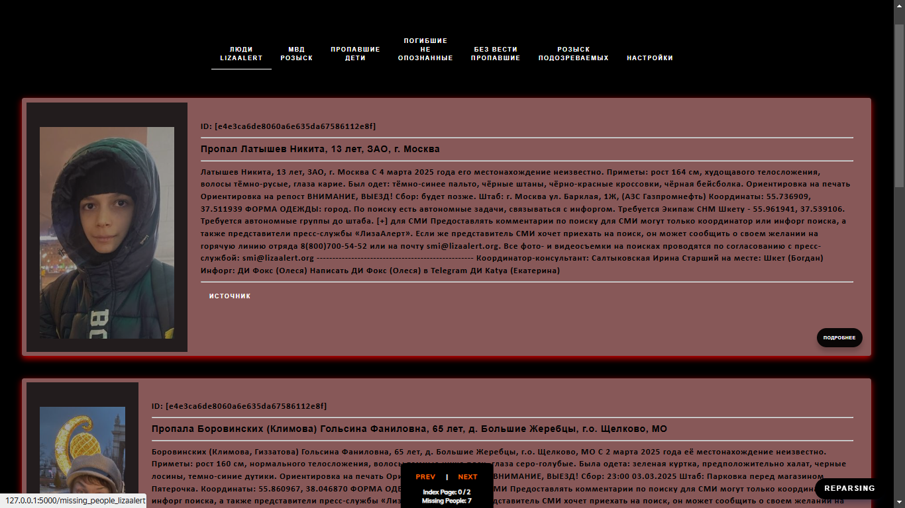

# missing_people

> Description

```
Parsing web site sk msk alert missing people
and list view in my flask app
```

> Address

```
http://127.0.0.1:5000
```

> demo video

```
https://youtu.be/_7yTklBIYKM
```

> demo screen page




